  

## 👋 Hi, I'm Brandon Melendez-Rodriguez

**Cognitive Science: Machine Learning & Neural Computation @ UC San Diego**

### 🛠️ Tech Stack

**Programming Languages**

Python · R · SQL

**Data Science & Machine Learning**

pandas · NumPy · SciPy · scikit-learn · nilearn · Jupyter Notebooks

**Statistical Modeling & Causal Inference**

tidyverse · fixest · ggplot2 · Difference-in-Differences · Regression · Classification

**Analytics & Visualization**

Tableau · Power BI · Microsoft Excel

**Methods & Techniques**

PCA · Clustering (K-means, EM, Hierarchical) · Cross-Validation · Regularization (Ridge/LASSO) · Dimensionality Reduction

**Developer Tools**

Git · GitHub · VS Code · Positron

  

---

### 💼 Experience Highlights

**Data Science & Analytics — UC San Diego**
- Applied ML, causal inference, and statistical modeling across academic and independent projects.

- Combined R, Python, and LLM APIs for large-scale text classification and analysis.

  

---

### 📊 Featured Projects

**Coca-Cola Reddit Sentiment — Difference-in-Differences**
Measured a ~39% spike in consumer complaints using DiD across ~54K Reddit posts, pairing R with LLM APIs for classification at scale. *(R · fixest · LLM APIs)*

**Fast Food Nutrition Regression**
Backward stepwise regression (R² ≈ 0.72, n = 859) that outperformed the published Weight Watchers points formula. *(Python · scikit-learn)*

**COVID Housing Market — Difference-in-Differences**
Identified a +2.28 percentage-point suburban price premium during the pandemic shift. *(R · fixest)*

  

---

### 🎓 Education

**University of California, San Diego (UCSD)**
B.S. Cognitive Science — Machine Learning & Neural Computation

  

### 🏆 Technical Focus

**Applied ML & Statistics**
Causal Inference (DiD) · Regression Models · Classification · Clustering
Tools: Python · R · scikit-learn · pandas · fixest

**Data & Analytics**
NLP at Scale · Sentiment Analysis · Predictive Modeling · Dashboarding
Tools: SQL · Tableau · Power BI

  

---

### 📫 Let's Connect

**Email:** brandonmelendezrodr@gmail.com
**LinkedIn:** [linkedin.com/in/brandonmelendezrodriguez](https://linkedin.com/in/brandonmelendezrodriguez)

  

